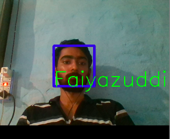

# face_Recognition
Face recognition System using opencv.

The whole system can be classifed into three parts:
1)Data Generator.
2)Trainer.
3)Detector.

#Data Generator--
 It take pictures of the person face using the webcam and then store that picture in the dedicated folder data set.
 Each person is given a particular id.
 
 #Trainer--
 In this step the data set that was created in thr previous step is trained using the haarcascade fraontal face default file.
 The resultant ia a trained dats in yml format whichn is stored in the Trainer folder which will be used for face recognition.
 
 #Detector--
 This is the final step which performs the function of face detection.As we run the program it starts to match the face of
 person in front of the camera with the dataset stored inthe database.If the faces match upto a certain criteria then in the 
 output screen a rectagle will beformed in the poisition of the face along with the name(ie id)of the person.
 If it does not matches with the face it will give an id of unknown.
